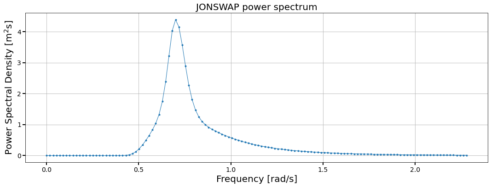
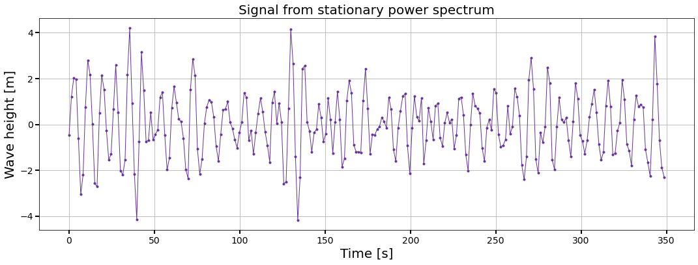
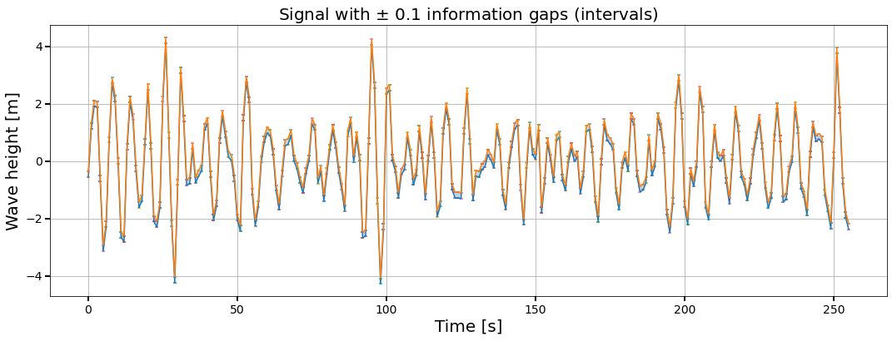
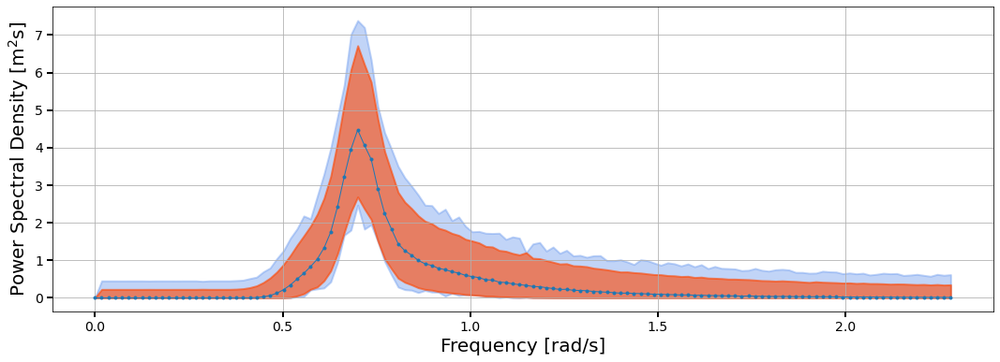
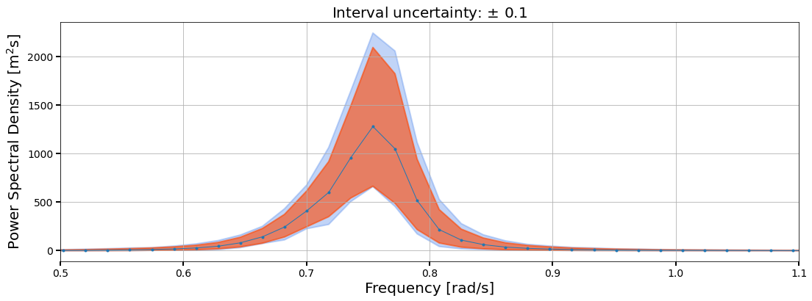
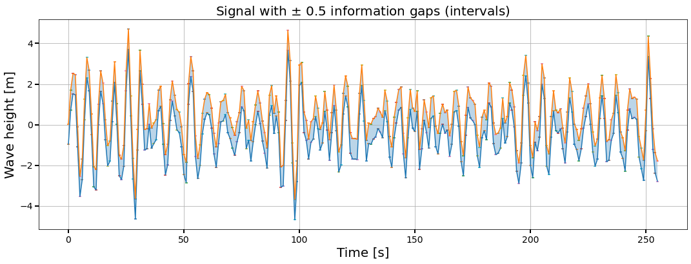
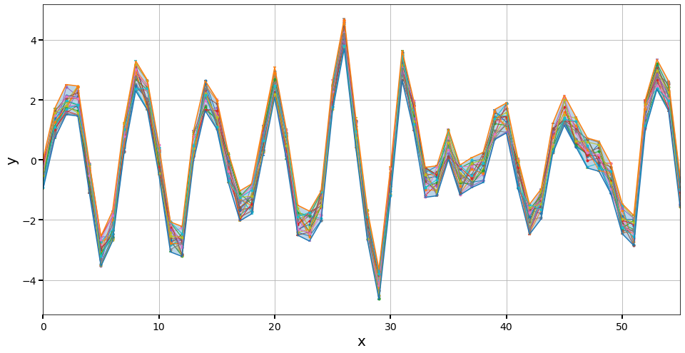
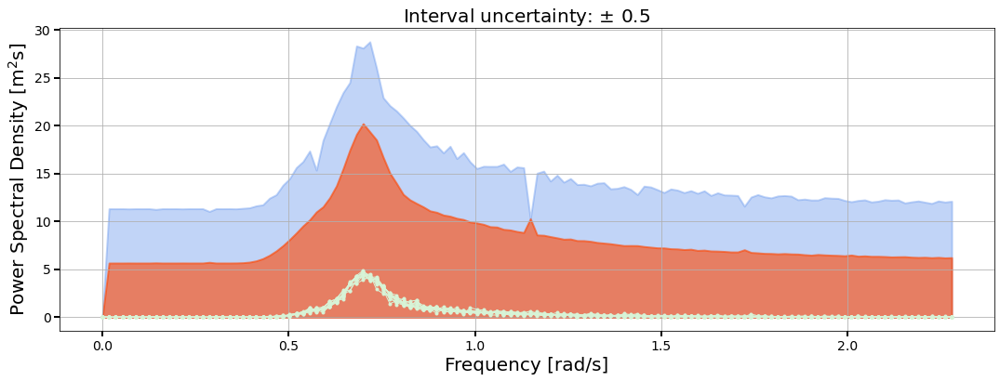
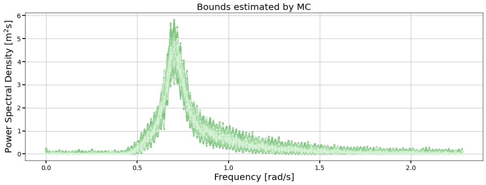

# Projecting interval uncertainty through the discrete Fourier transform

This repository provides a method that can propagate interval uncertainty through the discrete Fourier transform while yielding the exact bounds on the Fourier amplitude and Power Spectral Density function. The algorithm applies to real sequences of intervals. The method allows technical analysts to project interval uncertainty present in the time signals to their Fourier amplitude without making assumptions about the error distribution at each time step. Thus, it is possible to calculate and analyse system responses in the frequency domain without conducting extensive Monte Carlo simulations in the time domain. The applicability of this method in practice is demonstrated by a technical application.

*Disclaimer:* This code was developed for illustration purposes and for proof-of-concept. Thus this code is not optimized for large-scale applications. An optimized version of the code is currently under development.

## References
**De Angelis, M.; Behrendt, M.; Comerford, L.; Zhang, Y.; Beer, M. (2021):** Forward interval propagation through the discrete Fourier transform, The 9th international workshop on Reliable Engineering Computing, [arXiv:2012.09778](https://arxiv.org/abs/2012.09778).

## Installation
Clone the git repository on your machine, `cd` to the repository, open a Python3 interpreter and import the *interval Fourier transform* ans other useful packages

```python
from fourier.transform import transform as intervalDFT
from fourier.application import application as app
from fourier.number import number as int_num
import numpy
from numpy import (arange, cos, exp, linspace, mean, pi,  sin, zeros) 
from matplotlib import pyplot, cm
```

## Signal generation and interval DFT
At first time and frequency parameters and an analytical PSD function are needed to model a stochastic process. 

### Define parameters

```python
wu = 2.2975 # upper cut-off frequency
T = 350 # total time length

dt = 2*pi /(2*wu) # timestep size
dw = 2*pi / T # frequency step size

t = numpy.arange(0,T,dt) # time vector
w = numpy.arange(0,wu,dw) # frequency vector
```

### JONSWAP power spectrum
The JONSWAP power spectrum is utilised to generate stochastic processes. The required parameters are:

```python
alpha = 0.0081 # spectral energy parameter
w_p = 0.7 # peak frequency
gamma = 3.3 # peak enhancement factor
sigma1 = 0.07 # spectral width parameter for w <= w_p
sigma2 = 0.09 # spectral width parameter for w > w_p
spectrum = app.jonswap_spectrum(w,alpha,w_p,gamma,sigma1,sigma2)
```

### Plot the JONSWAP power spectrum
```python
ax = app.plot_line(w,spectrum,figsize=(18,6),xlabel=r'#$x$',ylabel='$x$',color=None,lw=1,title='JONSWAP power spectrum',ax=None,label=None)
ax.set_xlabel('Frequency [rad/s]',fontsize=20)
ax.set_ylabel('Power Spectral Density [m$^2$s]',fontsize=20)
```


### Generate time signal and intervalize it
To generate a stochastic process the spectral representation method is utilised. This signal is then intervalized with interval uncertainty ±0.1. Both signals are  plotted.
```python
sea_waves = app.stochastic_process(spectrum,w,t) 
pm = 0.1
sea_waves_interval = intervalDFT.intervalize(sea_waves, pm)

ax = app.plot_line(t,sea_waves,figsize=(18,6),xlabel='Time [s]',ylabel='Wave height [m]',color='rebeccapurple',lw=1,title='Signal from stationary power spectrum',ax=None,label=None)
sea_waves_interval.plot(xlabel='Time [s]',ylabel='Wave height [m]',title=r'Signal with $\pm$ '+str(pm)+' information gaps (intervals)')
```



### Compute the Fourier transforms
Compute the Fourier transform of the crisp signal and the interval Fourier transform for the interval signal with the selective method and the interval method. Also compute the periodogram of respective (bounded) Fourier amplitudes.

```python
FA = intervalDFT.Fourier_amplitude(sea_waves)
BI,BS = intervalDFT.compute_amplitude_bounds(sea_waves_interval)
BI.insert(0,int_num.Interval(0,0))
BS.insert(0,int_num.Interval(0,0))

FA = app.periodogram(FA, t, dt)
BI = app.periodogram(BI, t, dt)
BS = app.periodogram(BS, t, dt)
```

### Plot the interval Fourier transform
The amplitude of the crisp signal and both bounded Fourier amplituted are plotted.
```python
ax = app.plot_line(w,FA,figsize=(18,6),xlabel=r'#$x$',ylabel=r'$x$',color=None,lw=1,title=None,ax=None,label='Interval uncertainty: $\pm$ '+str(pm)+'')
app.plot_bounds(x=w,bounds=BI,color='cornflowerblue',alpha=0.4,ax=ax)
app.plot_bounds(x=w,bounds=BS,color='orangered',alpha=0.6,ax=ax)
ax.set_xlabel('Frequency [rad/s]',fontsize=20)
ax.set_ylabel('Power Spectral Density [m$^2$s]',fontsize=20)
ax.tick_params(direction='out', length=6, width=2, labelsize=14)
```


## Application to a SDOF system
The system under investigation is a offshore wind turbine simplified to a SDOF system. The parameters are set to
```python
R = 3 # outer radius
r = 2.8 # inner radius
h_pile = 60 # height
rho_steel = 7800 # density of steel
c = 1e5 # stiffness
k = 1e6 # damping coefficient
```
Get the natural frequency ```w0``` and the damping ratio ```xi```
```python
w0,xi = app.wind_turbine(R,r,h_pile,rho_steel,c,k)
```

The response can be obtained by pushing the (intervalised) signal through the frequency response function
```python
freq_response_precise = app.frequency_response(w,FA,w0,xi)
freq_response_BI_low,freq_response_BI_high = app.frequency_response_interval(w,BI,w0,xi)
freq_response_BS_low,freq_response_BS_high = app.frequency_response_interval(w,BS,w0,xi)
```

Those responses can be plotted

```python
ax = app.plot_line(w,freq_response_precise,figsize=(18,6),xlabel=r'#$x$',ylabel=r'$x$',color=None,lw=1,title=None,ax=None,label=None)
ax.fill_between(x=w,y1=freq_response_BI_low,y2=freq_response_BI_high, alpha=0.4, label='Interval', edgecolor='blue', lw=2, color='cornflowerblue')
ax.fill_between(x=w,y1=freq_response_BS_low,y2=freq_response_BS_high, alpha=0.6, label='Selective', edgecolor='red', lw=2, color='orangered')

ax.set_xlabel('Frequency [rad/s]',fontsize=20)
ax.set_ylabel('Power Spectral Density [m$^2$s]',fontsize=20)
ax.set_title(r'Interval uncertainty: $\pm$ '+str(pm)+'', fontsize=20)

ax.tick_params(direction='out', length=6, width=2, labelsize=14)
_=ax.set_xlim([0.5, 1.1])
```



## Comparison with Monte Carlo
In this section it is illustrated how severe interval uncertainty is underestimated by Monte Carlo. To show this, a signal with interval uncertainty ±0.5 is utilised and plotted.

```python
pm = 0.5
sea_waves_interval_05 = intervalDFT.intervalize(sea_waves, pm)
sea_waves_interval_05.plot(xlabel='Time [s]',ylabel='Wave height [m]',title=r'Signal with $\pm$ '+str(pm)+' information gaps (intervals)')
```


Generate some random signals between the bounds. All signals which are within or on the bounds are possible.
```python
RAND_SIGNALS = sea_waves_interval_05.rand(N=20) # this picks out N (inner) random signals within the bounds

fig,ax = intervalDFT.subplots(figsize=(16,8))
for rs in RAND_SIGNALS:
    intervalDFT.plot_signal(rs,ax=ax)
sea_waves_interval_05.plot(ax=ax)
ax.grid()
_=ax.set_xlim(0,55) # underscore here is used to suppress the output of this line
```



Computing the Fourier amplitude bounds and the periodogram of the interval signal 
```python
BI,BS = intervalDFT.compute_amplitude_bounds(sea_waves_interval_05)
BI.insert(0,int_num.Interval(0,0))
BS.insert(0,int_num.Interval(0,0))

BI = app.periodogram(BI, t, dt)
BS = app.periodogram(BS, t, dt) 
```

Plotting the bounds of the Fourier amplitude in comparison to the resulting bounds obtained by Monte Carlo
```python
BI_low=[ai.lo() for ai in BI]
BI_high=[ai.hi() for ai in BI]
BS_low=[ai.lo() for ai in BS]
BS_high=[ai.hi() for ai in BS]

fig = pyplot.figure(figsize=(18,6))
ax = fig.subplots()
ax.grid()
ax.fill_between(x=w,y1=BI_low,y2=BI_high, alpha=0.4, label='Interval', edgecolor='blue', lw=2, color='cornflowerblue')
ax.fill_between(x=w,y1=BS_low,y2=BS_high, alpha=0.6, label='Selective', edgecolor='red', lw=2, color='orangered')

n_MC = 10
for x in range(n_MC):
    FX = intervalDFT.Fourier_amplitude(sea_waves_interval_05.rand())
    FX = app.periodogram(FX, t, dt)
    #intervalDFT.plot_line(w,FX,figsize=None,xlabel=r'#$x$',ylabel=r'$x$',color='palegreen',lw=1,title=None,ax=ax,label=None) 
    app.plot_line(w,FX,figsize=None,xlabel=r'#$x$',ylabel=r'$x$',color='#d7f4d7',lw=1,title=None,ax=ax,label=None) 

ax.set_xlabel('Frequency [rad/s]',fontsize=20)
ax.set_ylabel('Power Spectral Density [m$^2$s]',fontsize=20)
ax.set_title(r'Interval uncertainty: $\pm$ '+str(pm)+'', fontsize=20)

ax.tick_params(direction='out', length=6, width=2, labelsize=14)  
```


Which increasing sample size, the range within the bounds of the interval signal is better covered. However, even a very high sample size is insufficient to get close to the bounds obtained by the interval DFT. 
```python
fig = pyplot.figure(figsize=(18,6))
ax = fig.subplots()
ax.grid()

n_MC = 1000
for x in range(n_MC):
    FX = intervalDFT.Fourier_amplitude(sea_waves_interval_05.rand())
    FX = app.periodogram(FX, t, dt)
    app.plot_line(w,FX,figsize=None,xlabel=r'#$x$',ylabel=r'$x$',color='#7cc47c',lw=1,title=None,ax=ax,label=None) 
    
n_MC = 100
for x in range(n_MC):
    FX = intervalDFT.Fourier_amplitude(sea_waves_interval_05.rand())
    FX = app.periodogram(FX, t, dt)
    app.plot_line(w,FX,figsize=None,xlabel=r'#$x$',ylabel=r'$x$',color='#a7d9a7',lw=1,title=None,ax=ax,label=None) 
    
n_MC = 10
for x in range(n_MC):
    FX = intervalDFT.Fourier_amplitude(sea_waves_interval_05.rand())
    FX = app.periodogram(FX, t, dt)
    app.plot_line(w,FX,figsize=None,xlabel=r'#$x$',ylabel=r'$x$',color='#d7f4d7',lw=1,title=None,ax=ax,label=None) 
    
ax.set_xlabel('Frequency [rad/s]',fontsize=20)
ax.set_ylabel('Power Spectral Density [m$^2$s]',fontsize=20)
_=ax.set_title('Bounds estimated by MC', fontsize=20) 
```

